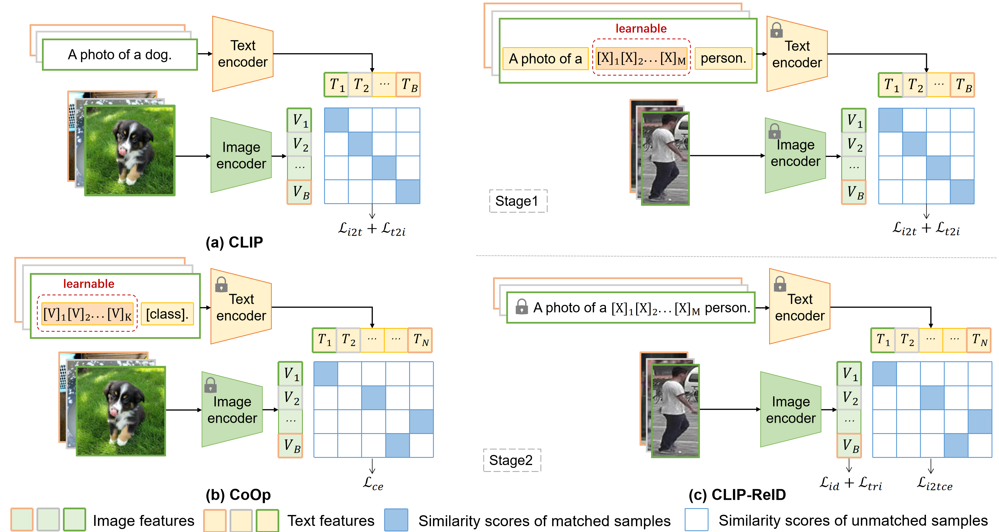

## CLIP-ReID: Exploiting Vision-Language Model for Image Re-Identification without Concrete Text Labels [[pdf]](https://arxiv.org/pdf/2211.13977.pdf)
 [](https://paperswithcode.com/sota/person-re-identification-on-msmt17?p=clip-reid-exploiting-vision-language-model)

### Pipeline



### Installation

```
conda create -n clipreid python=3.8
conda activate clipreid
conda install pytorch==1.8.0 torchvision==0.9.0 torchaudio==0.8.0 cudatoolkit=10.2 -c pytorch
pip install yacs
pip install timm
pip install scikit-image
pip install tqdm
pip install ftfy
pip install regex
```

### Prepare Dataset

Download the datasets ([Market-1501](https://drive.google.com/file/d/0B8-rUzbwVRk0c054eEozWG9COHM/view), [MSMT17](https://arxiv.org/abs/1711.08565), [DukeMTMC-reID](https://arxiv.org/abs/1609.01775), [Occluded-Duke](https://github.com/lightas/Occluded-DukeMTMC-Dataset), [VehicleID](https://www.pkuml.org/resources/pku-vehicleid.html), [VeRi-776](https://github.com/JDAI-CV/VeRidataset)), and then unzip them to `your_dataset_dir`.

### Training

For example, if you want to run CNN-based CLIP-ReID-baseline for the Market-1501, you need to modify the bottom of configs/person/cnn_base.yml to

```
DATASETS:
   NAMES: ('market1501')
   ROOT_DIR: ('your_dataset_dir')
OUTPUT_DIR: 'your_output_dir'
```

then run 

```
CUDA_VISIBLE_DEVICES=0 python train.py --config_file configs/person/cnn_base.yml
```

if you want to run ViT-based CLIP-ReID for MSMT17, you need to modify the bottom of configs/person/vit_clipreid.yml to

```
DATASETS:
   NAMES: ('msmt17')
   ROOT_DIR: ('your_dataset_dir')
OUTPUT_DIR: 'your_output_dir'
```

then run 

```
CUDA_VISIBLE_DEVICES=0 python train_clipreid.py --config_file configs/person/vit_clipreid.yml
```

if you want to run ViT-based CLIP-ReID+SIE+OLP for MSMT17, run:

```
CUDA_VISIBLE_DEVICES=0 python train_clipreid.py --config_file configs/person/vit_clipreid.yml  MODEL.SIE_CAMERA True MODEL.SIE_COE 1.0 MODEL.STRIDE_SIZE '[12, 12]'
```

### Evaluation

For example, if you want to test ViT-based CLIP-ReID for MSMT17

```
CUDA_VISIBLE_DEVICES=0 python test_clipreid.py --config_file configs/person/vit_clipreid.yml TEST.WEIGHT 'your_trained_checkpoints_path/ViT-B-16_60.pth'
```

### Acknowledgement

Codebase from [TransReID](https://github.com/damo-cv/TransReID), [CLIP](https://github.com/openai/CLIP), and [CoOp](https://github.com/KaiyangZhou/CoOp).

The veri776 viewpoint label is from https://github.com/Zhongdao/VehicleReIDKeyPointData.

### Trained models and test logs

|       Datasets        |                            MSMT17                            |                            Market                            |                             Duke                             |                           Occ-Duke                           |                             VeRi                             |                          VehicleID                           |
| :-------------------: | :----------------------------------------------------------: | :----------------------------------------------------------: | :----------------------------------------------------------: | :----------------------------------------------------------: | :----------------------------------------------------------: | :----------------------------------------------------------: |
|     CNN-baseline      | [model](https://drive.google.com/file/d/1s-nZMp-LHG0h4dFwvyP_YNBLTijLcrb0/view?usp=share_link)\|[test](https://drive.google.com/file/d/18EQmBB1-GStmnNvaFNrVbKaaoLIW2Jyz/view?usp=share_link) | [model](https://drive.google.com/file/d/15E4K9eGXMlqOGE1RAgXQjF4MzrFobGim/view?usp=share_link)\|[test](https://drive.google.com/file/d/1CxzntZ8531NWmnp6AUrZh8GCWgunF2XA/view?usp=share_link) | [model](https://drive.google.com/file/d/1f9ZgJZSph7kV7xjhfBVIjFG0hwgeSsSy/view?usp=share_link)\|[test](https://drive.google.com/file/d/1I40OxzlONTZ0oX1CXcVPcDNtkTbq1YZF/view?usp=share_link) | [model](https://drive.google.com/file/d/1gdokL9QoldUOiaRUGJ1fS0BXEnHGM8MX/view?usp=share_link)\|[test](https://drive.google.com/file/d/1Kj1Eem9ZgEP9-1gCPDNuxGukdK_-UamA/view?usp=share_link) | [model](https://drive.google.com/file/d/1crKPNqQaf0WA9x7xW5MqCrOGxLlDy1ee/view?usp=share_link)\|[test](https://drive.google.com/file/d/1a-X8RPCurM1o5amRR2urEkIpYsQScNod/view?usp=share_link) | [model](https://drive.google.com/file/d/1pTd6ZFzTJINmZ-0eJWReHqTMEgg775Vw/view?usp=share_link)\|[test](https://drive.google.com/file/d/1BSIKWkbEoBd7JBlYg7aC_ZNeBZBU-70l/view?usp=share_link) |
|     CNN-CLIP-ReID     | [model](https://drive.google.com/file/d/1VdlC1ld3NrQC5Jcx0hntXRb-UaR3tMtr/view?usp=share_link)\|[test](https://drive.google.com/file/d/1asywo90Va_XRL-AZ3tO4vZuzoAmnnCeJ/view?usp=share_link) | [model](https://drive.google.com/file/d/1sBqCr5LxKcO9J2V0IvLQPb0wzwVzIZUp/view?usp=share_link)\|[test](https://drive.google.com/file/d/1u2x5_c5iNYaQW6sL5SazP4NUMBnCNZb9/view?usp=share_link) | [model](https://drive.google.com/file/d/1XXycuux__uDd9WKwaTAQ4W1RjLqnUphq/view?usp=share_link)\|[test](https://drive.google.com/file/d/1sc12hq0YW3_BeGj6Z84v4r763i8hFyeT/view?usp=share_link) | [model](https://drive.google.com/file/d/1naz7QjzYlC2qe4SHxjxss4tP81KRCrMj/view?usp=share_link)\|[test](https://drive.google.com/file/d/1Y3Ccg6fnVwsyIYVyagZbk4QTLwABrGJ9/view?usp=share_link) | [model](https://drive.google.com/file/d/18s8NkQQwLOgLLpXZwaLed2L-L6ZYrXUN/view?usp=share_link)\|[test](https://drive.google.com/file/d/1K-S3YB7F46V86GB36P9Nv127TIRVbBBg/view?usp=share_link) | [model](https://drive.google.com/file/d/1iotObjA5EmVG2-wj7iUy8ZVD7y0XMMeQ/view?usp=share_link)\|[test](https://drive.google.com/file/d/1zWYyFplNcQC9X2qMueelSjkpLCO97DE8/view?usp=share_link) |
|     ViT-baseline      | [model](https://drive.google.com/file/d/1I715ZWacRvEGLiju1bZ9xcmUhhFx0aN6/view?usp=share_link)\|[test](https://drive.google.com/file/d/1ClJz0lokY1fBZKn1TcFZZEd9O-YupRtl/view?usp=share_link) | [model](https://drive.google.com/file/d/1XKUcP4LEpWr4Ah6sVdXNveUo4bAsVyjt/view?usp=share_link)\|[test](https://drive.google.com/file/d/18xkr609oK_TdOzVZviZYMq48ZVANO5S6/view?usp=share_link) | [model](https://drive.google.com/file/d/13qSSyi87Bkj3Qq-UKy3646vuIyIaE7Mt/view?usp=share_link)\|[test](https://drive.google.com/file/d/1IrelYMW2kunsO45ghwzGWvxjPoC1mihN/view?usp=share_link) | [model](https://drive.google.com/file/d/1bjgAbg9DE0niEQ9PTyywt8asjpCOKhfX/view?usp=share_link)\|[test](https://drive.google.com/file/d/119nMZOGMjvqHBlBNC3viNSto31QSN4sT/view?usp=share_link) | [model](https://drive.google.com/file/d/1LeqWNuTGM87JpbhR6tMK2u91ckwlYI1T/view?usp=share_link)\|[test](https://drive.google.com/file/d/1lwkBUGyhsvmu3NajSY80oC4cnRsQyXtR/view?usp=share_link) | [model](https://drive.google.com/file/d/1Nxowc7pvvNPG6O-TV4aRaL5BgdzJ1Dl9/view?usp=share_link)\|[test](https://drive.google.com/file/d/1sj7W-kr376XU5oKVFOGu1Bi_NsO1cDjn/view?usp=share_link) |
|     ViT-CLIP-ReID     | [model](https://drive.google.com/file/d/1BVaZo93kOksYLjFNH3Gf7JxIbPlWSkcO/view?usp=share_link)\|[test](https://drive.google.com/file/d/1_b1WOkyWP6PI4z1Owwtt5Un1YmdQFbqy/view?usp=share_link) | [model](https://drive.google.com/file/d/1GnyAVeNOg3Yug1KBBWMKKbT2x43O5Ch7/view?usp=share_link)\|[test](https://drive.google.com/file/d/1SKtpls1rtcuC-Xul-uVhEOtFKf8a1zDt/view?usp=share_link) | [model](https://drive.google.com/file/d/1ldjSkj-7pXAWmx8on5x0EftlCaolU4dY/view?usp=share_link)\|[test](https://drive.google.com/file/d/1pUID2PgmWkdfUmAZthXvOsI4F6ptx6az/view?usp=share_link) | [model](https://drive.google.com/file/d/1FduvrwOWurHtYyockakn2hBrbGH0qJzH/view?usp=share_link)\|[test](https://drive.google.com/file/d/1qizsyQCMtA2QUc1kCN0lg7UEaEvktgrj/view?usp=share_link) | [model](https://drive.google.com/file/d/1RyfHdOBI2pan_wIGSim5-l6cM4S2WN8e/view?usp=share_link)\|[test](https://drive.google.com/file/d/1RhiqztoInkjBwDGAcL2437YA7qTwzEsk/view?usp=share_link) | [model](https://drive.google.com/file/d/168BLegHHxNqatW5wx1YyL2REaThWoof5/view?usp=share_link)\|[test](https://drive.google.com/file/d/110l_8I2LQ3OfZP1xElF2Jl4lRvvhweYf/view?usp=share_link) |
| ViT-CLIP-ReID-SIE-OLP | [model](https://drive.google.com/file/d/1sPZbWTv2_stXBGutjHMvE87pAbSAgVaz/view?usp=share_link)\|[test](https://drive.google.com/file/d/1t-G143aD4qH6FWQP60EdjuJvYFvjAoXP/view?usp=share_link) | [model](https://drive.google.com/file/d/1K32xrosw0gPrxYCWXER81mhWObEW5-d4/view?usp=share_link)\|[test](https://drive.google.com/file/d/1UqE0zCTSaob4NMgKN_wjBEdtJJPSb3hW/view?usp=share_link) | [model](https://drive.google.com/file/d/1zkHLrLy3z9lP0cR2MVQtr4ujoC6eQLKP/view?usp=share_link)\|[test](https://drive.google.com/file/d/1cZ9d3gyQkOlWNPCmjpiaEKA7NiyIk9jY/view?usp=share_link) | [model](https://drive.google.com/file/d/18RU-3_QUr2fehUjW_RfeIllbCDUaZZvP/view?usp=share_link)\|[test](https://drive.google.com/file/d/1XI2rNMJcHHxUbHrIDL9WXasErJ3zutpD/view?usp=share_link) | [model](https://drive.google.com/file/d/1vb-mMGp7q_aqAB1U_uAGsHZ1U9HViOgE/view?usp=share_link)\|[test](https://drive.google.com/file/d/16Yu3yp3HKnIZHr-AkrilqJvTtraxQO5b/view?usp=share_link) | [model](https://drive.google.com/file/d/19B7wHJ29VByFHiF9OJhI5C6q0V68NOKn/view?usp=share_link)\|[test](https://drive.google.com/file/d/1o6oGAsjrmwPnefQmnd72MDgn-Ie36XV5/view?usp=share_link) |

Note that all results listed above are without re-ranking.

With re-ranking, ViT-CLIP-ReID-SIE-OLP achieves 86.7% mAP and  91.1% R1 on MSMT17.
### Citation

If you use this code for your research, please cite

```
@article{li2022clip,
  title={CLIP-ReID: Exploiting Vision-Language Model for Image Re-Identification without Concrete Text Labels},
  author={Li, Siyuan and Sun, Li and Li, Qingli},
  journal={arXiv preprint arXiv:2211.13977},
  year={2022}
}
```

